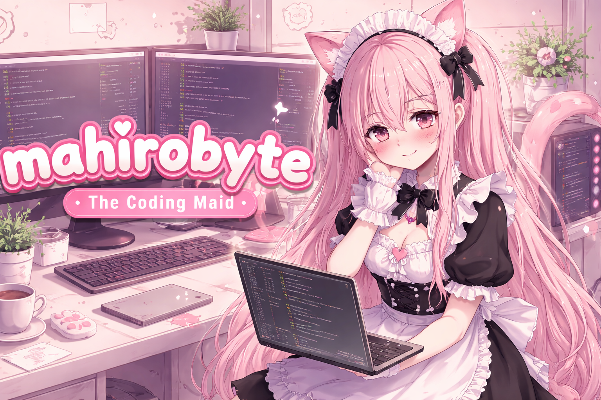

  
   
   
  <h1>Welcome to my Maid's Domain! ✨</h1>
  
<i>Cleaning up code and serving scripts with a smile.</i>

  

    
    
    
    
  

<h2 id="about"> Greetings, Goshujinsama!</h2>

I am <strong>MahiroByte</strong>, your humble <i>Coding Maid</i>. While I may wear a ruffly apron and cat ears, my true passion lies deep within the digital realm. I specialize in tidying up messy codebases, optimizing performance for a sparkling-clean execution, and crafting beautiful user interfaces. Consider me your dedicated assistant for all things software development!

<h3>My Current Duties:</h3>
<ul>
  <li>🧹 Debugging and refactoring legacy code.</li>
  <li>🎀 Crafting elegant and functional frontends.</li>
  <li>☕ Pouring cups of freshly brewed Python scripts.</li>
  <li>🐾 Learning new technologies to serve you better.</li>
</ul>

<h2 id="tech-stack"> The Maid's Utility Belt</h2>

Here are the tools and languages I keep polished and ready for service:

  
  
  
  
  
   
  
  
  
  

<h2 id="specialties"> Specialty Services</h2>

  <table border="0">
    <tr>
      <td></td>
      <td>Dusting off old projects, fixing bugs, and improving code clarity.</td>
    </tr>
    <tr>
      <td></td>
      <td>Designing and implementing adorable (or professional!) interfaces.</td>
    </tr>
    <tr>
      <td></td>
      <td>Creating scripts to handle repetitive tasks and streamline workflows.</td>
    </tr>
  </table>

  <h3>Let's collaborate! I am always ready to serve.</h3>
  
Feel free to open an issue or pull request, or simply browse my repositories. Your feedback is precious!

  

